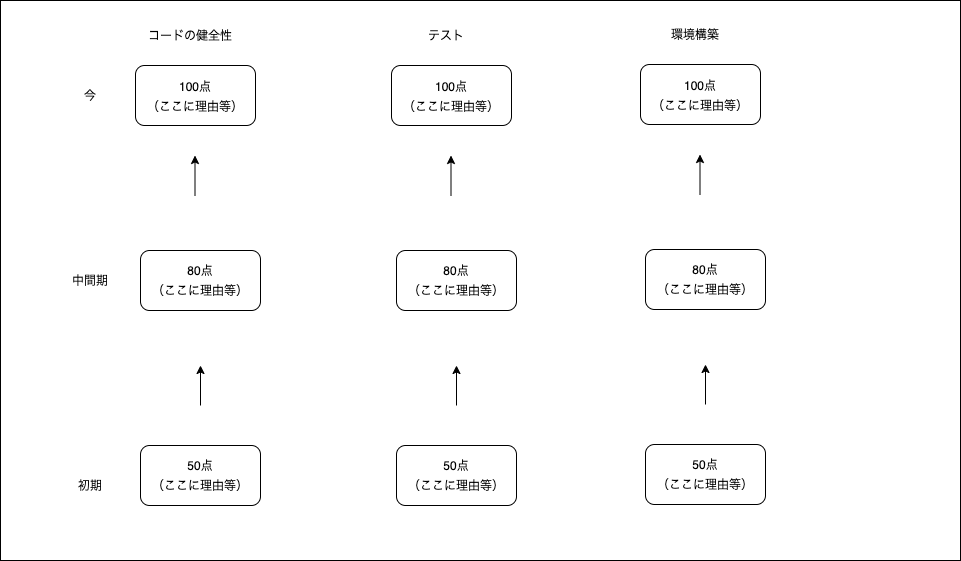

# プロジェクト概要

レポジトリの「今」と「これまで」を可視化するサービス。どのように **今** になったのか **これまで** からも含め可視化することで、どのような変遷を辿ったかを可視化する。

## 可視化する項目（予定）

- コードの健全性
- テスト整備
- 環境構築
- コミットの構築

それぞれの項目について過去どのような変遷を辿るかを可視化することによって

- 「良い」レポジトリとはどのようなものか
- どのように「良い」プロダクトができていくのか
- 「良い」エンジニアはどのように行動しているのか

を理解する。

## デザイン図（大雑把）

## 背景

ソフトウェアエンジニアが自分の能力の把握・向上を考えるとき、2つの障害があると考えられる。

- (1)足りない能力がそもそもわからない
    - 優秀な人と比べてどのように/どのような能力が足りないのかわからない
        - 足りない能力を把握しようにも、1on1等や面談等の場で人から聞く必要があることが多く、どうしても個々の技術に関して話すのは難しい
    - 足りない能力がわかったとしても、どの程度足りないかわからない
        - 自分より優秀な人とどのような差があるのかわからない
- (2)どのような筋道でその能力差を埋めていくのかがわからない
    - 比較対象と同じようにやろうとしても、どのように挑戦していけばいいのかがわかりづらい

そこで

- (1)について、足りない能力を理解するためにレポジトリのデータを多角的に可視化して、理想的なレポジトリとどう違うのかを比較できると良いのではないか
- (2)について、どのような流れでレポジトリを構築しているのかが可視化されると、どのようにして（テストやCI/CD等、プログラミングを）実践していくのがよいのかのヒントになるのではないか

「今」(1)を可視化し、「これまで」(2)から学ぶ

# 使用技術

- サーバーサイド
    - Scala
        - 複数の要素を並列で計算することが得意な言語にしたいので
        - GitHubのログイン等が面倒であればGoあたりに変更するかも
- フロントエンド
    - React/TypeScript
- インフラ
    - 計算済みのデータを保存するRDB

# 大まかな実装案

1. ユーザーをGitHub認証でログインさせる
2. 自分のレポジトリと比較したいレポジトリを選ばせる（とりあえず自分のレポジトリだけ可視化するのでもいいかも）
3. 選んだレポジトリに対して集計を開始する
    - 計算には時間がかかると思うので、WebSocketか何かでつないで順次計算が終わったものからフロントに流す？
5. 表示