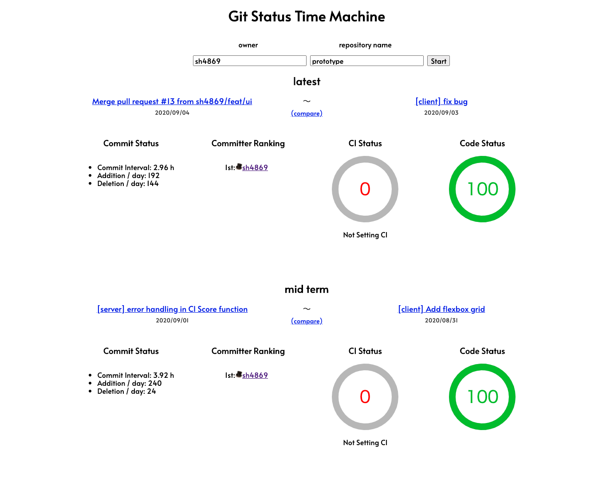

# git-status-time-machine



[発表スライド](https://docs.google.com/presentation/d/1JxCuKNgEX3OJlEK7PjTCS9Kt8orexiDxTJ-I7EQxCIo/edit?usp=sharing)

## 実行方法

- `git clone https://github.com/sh4869/git-status-time-machine.git`
- `client` ディレクトリで `yarn install` を実行する
- GitHub Tokenを[取得し](https://github.com/settings/tokens)、workerディレクトリに`.env`ファイルを置く

```.env
GITHUB_TOKEN=your_token_here
```

- `docker-compose up`で起動するので`localhost:3030`を見に行く


## ファイル

- [計画書](PLAN.md)
- [サーバー](server/)
- [クライアント](client/)
